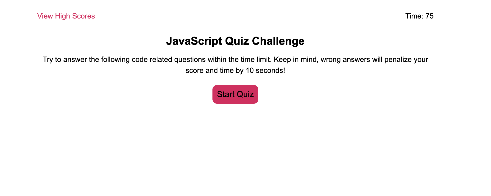

# Code Quiz

## User Story

AS A developer
I WANT to create a timed quiz using JavaScript fundamentals that stores high scores
SO THAT I can gauge my progress compared to my peers

## Acceptance Criteria

GIVEN I create a code quiz
WHEN the user clicks the start button
THEN a timer starts and they are presented with the first question
WHEN they answer a question
THEN they are presented with 4 other questions
WHEN they answer a question incorrectly
THEN time is subtracted from the clock
WHEN all questions are answered or the timer reaches 0
THEN the game is over
WHEN the game is over
THEN they can save their initials and score
When they click View High Scores
Then information added will be saved

## Assets

The following image demonstrates the web application's appearance and functionality:

\

*** I used multiple sources to complete what I have provided in the assignment. Stack overflow, Google, ChatGPT, and class mates. I am still trying to understand more of this project and this code which is why there are so many comments / it is not complete. I have a tutoring session scheduled in hopes of resubmitting the assignment with final code and a better understanding of the material.

## Deployment

https://jackegould.github.io/code-quiz/